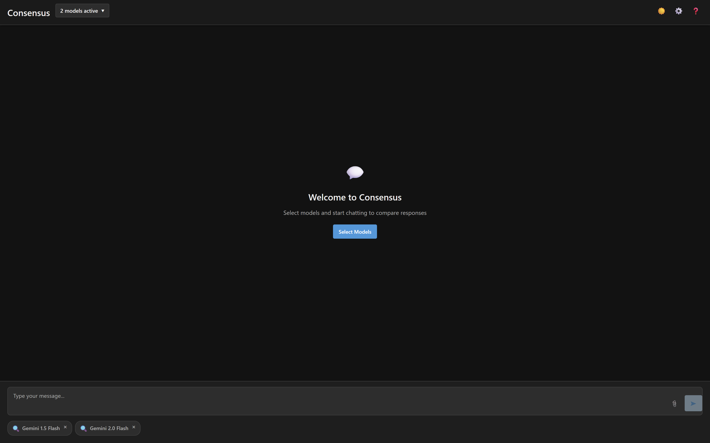
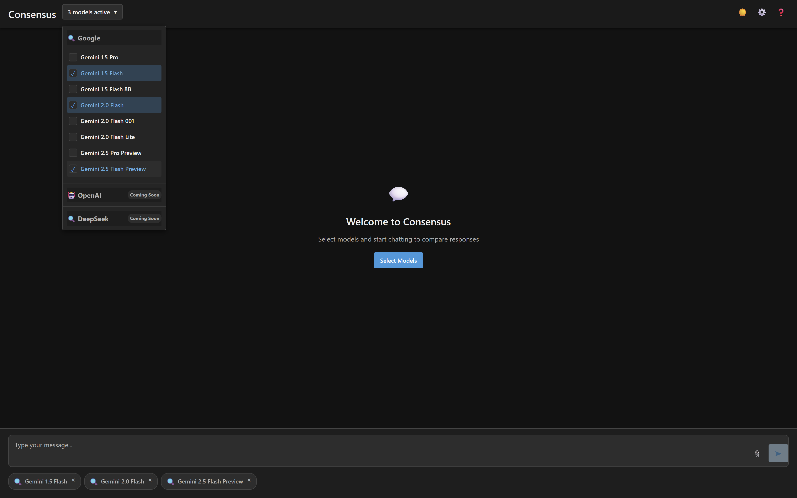
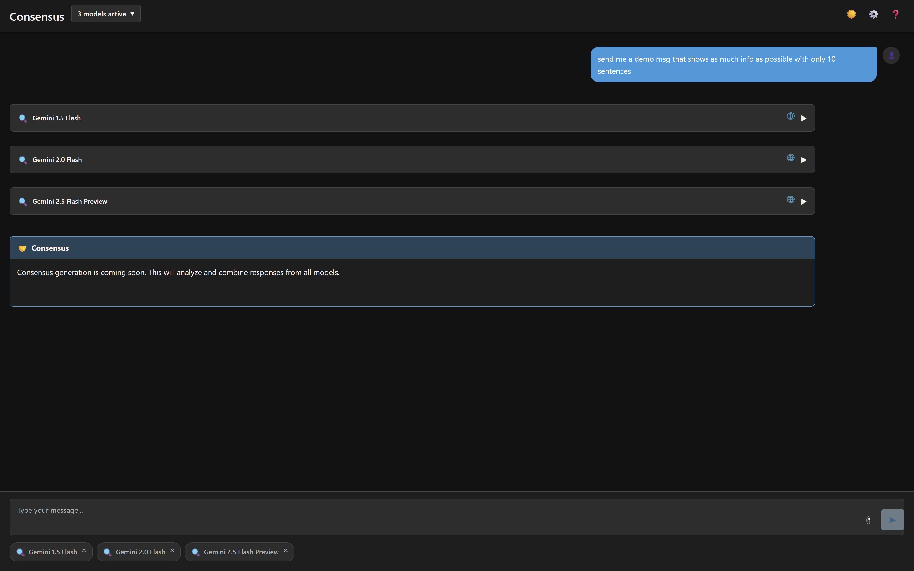
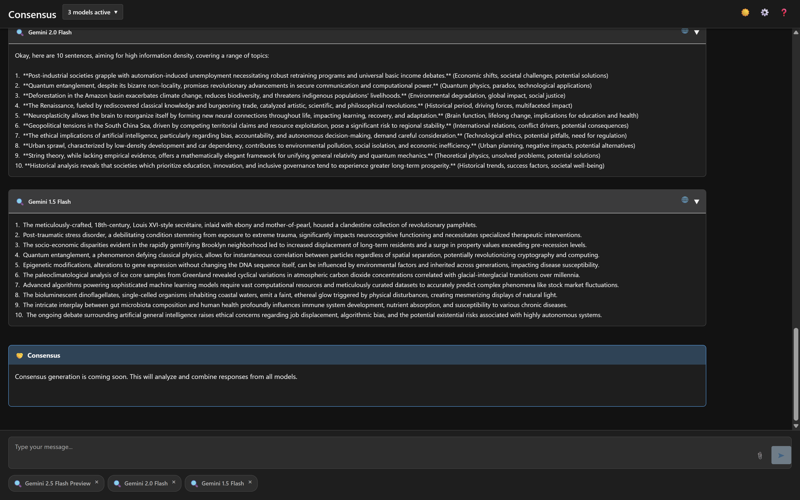

# Consensus

A prototype application showcasing responses from multiple LLMs (Large Language Models) in a unified interface.

## Demo

Below are some example screenshots of the application in action:

