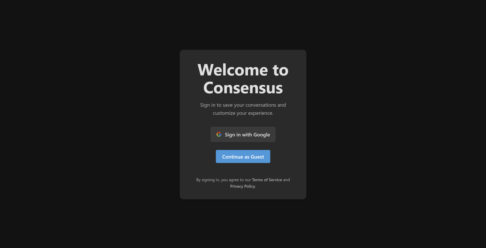
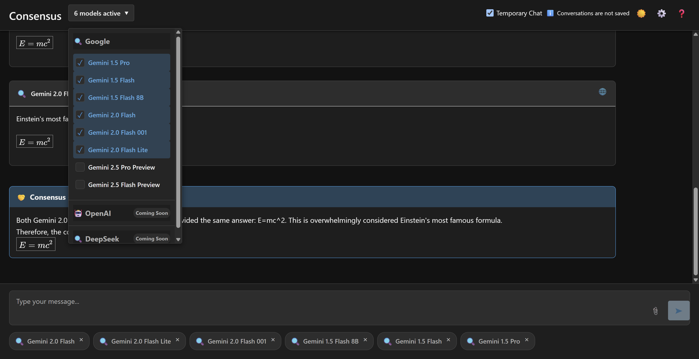

# Consensus

A prototype application showcasing responses from multiple LLMs (Large Language Models) in a unified interface.

## Demo

Below are some example screenshots of the application in action:

1.  **Welcome/Login Screen**: The initial screen for user sign-in or guest access.
    
2.  **Main Chat Interface & Model Selection**: Shows the primary chat view with a prompt, multiple model responses, and the model selector open.
    